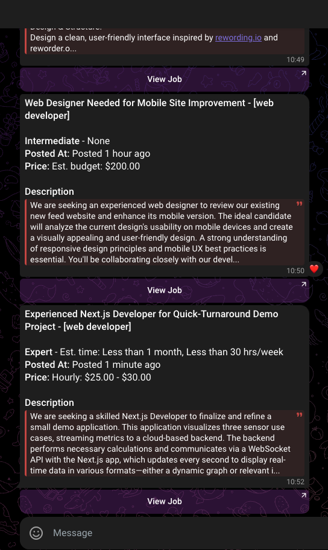

# Parker
> A tool to dig some gold in Upwork
> An Upwork job notification tool inspired by [zenfl.pro/bot](https://zenfl.pro/bot)

A personal project that monitors Upwork job postings based on custom search criteria (defined in urls.json) and sends notifications for new opportunities to a Telegram channel.

## ⚠️ Disclaimer

This tool is provided for educational and personal use only. By using this software, you acknowledge that:
- You are responsible for complying with Upwork's Terms of Service
- The creator is not responsible for any misuse of this tool
- Use at your own risk and ensure compliance with all applicable laws and regulations
- This is a personal project and not officially associated with Upwork

## 🚀 Features

- Custom search criteria configuration
- Real-time job monitoring
- Telegram notifications
- Configurable scanning intervals
- Low memory footprint

## 📋 Prerequisites

- Python 3.12 or higher
- Valid Upwork search URLs
